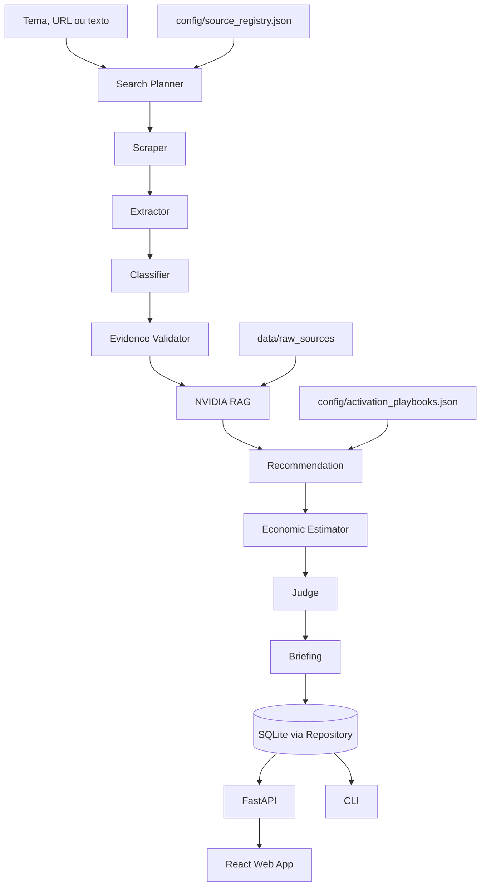

# NVIDIA Startup AI Radar

Plataforma para ajudar a NVIDIA a descobrir startups com potencial de uso real
de IA, entender a maturidade tecnica de cada uma e gerar uma recomendacao clara
de quais tecnologias NVIDIA fazem sentido para aquela oportunidade.

O projeto cobre o fluxo completo do case: descoberta outbound, coleta de paginas
publicas, triagem contra conteudo que nao e startup, extracao estruturada,
classificacao AI-native, consulta RAG sobre conhecimento NVIDIA, recomendacao,
briefing exportavel, revisao humana e observabilidade.

Documentacao completa do case e uso da plataforma:
[docs/guia-completo-do-case.md](docs/guia-completo-do-case.md)

## O Que A Plataforma Entrega

- Encontra candidatas em fontes publicas e remove tutoriais, Wikipedia,
  documentacao de framework e paginas sem contexto de empresa.
- Transforma texto publico em `StartupProfile`, o schema central do projeto.
- Classifica maturidade como `AI-native`, `AI-enabled`, `non-AI` ou
  `indeterminado`, com sinais fortes, sinais de risco e evidencias.
- Detecta stack concorrente, como AWS Bedrock, Google Vertex AI e Azure OpenAI.
- Consulta RAG com fontes NVIDIA para recomendar tecnologias como NIM, NeMo
  Guardrails, Triton, TensorRT-LLM, RAPIDS, Clara, Riva, Morpheus e Inception.
- Mostra oportunidades por startup, comparando dor, tecnologia recomendada,
  prioridade, maturidade, lacunas e proxima acao comercial.
- Roda com Groq quando a chave estiver disponivel e cai para fallback local
  quando nao houver chave, cota ou rede.

## Arquitetura



## Estrutura Do Repositorio

```text
.
|-- config/                         # fontes governadas e playbooks de ativacao
|-- data/raw_sources/                # corpus versionavel do RAG
|-- docs/guia-completo-do-case.md    # guia unico do case e uso da plataforma
|-- frontend/                        # interface React
|-- src/nvidia_startup_ai_radar/     # pipeline, agentes, RAG, API, storage
|-- tests/                           # testes automatizados e golden set
|-- .env.example                     # variaveis de ambiente documentadas
|-- pyproject.toml                   # dependencias Python travadas
|-- README.md                        # entrada principal do projeto
```

Arquivos gerados em execucao, como bancos SQLite, cache de scraping, exports,
relatorios, `frontend/dist` e `frontend/node_modules`, ficam fora do commit.

## Rodar Em 5 Minutos

### 1. Instalar Python

```powershell
python -m venv .venv
.\.venv\Scripts\Activate.ps1
pip install -e .[dev]
python -m playwright install chromium
```

### 2. Instalar Frontend

```powershell
cd frontend
npm install
npm run build
cd ..
```

### 3. Configurar Ambiente

Para rodar 100% local:

```powershell
$env:LLM_PROVIDER="none"
$env:RADAR_ENABLE_WEB_FETCH="false"
```

Para rodar com Groq:

```powershell
$env:LLM_PROVIDER="groq"
$env:GROQ_API_KEY="sua-chave"
$env:GROQ_MODEL="llama-3.3-70b-versatile"
$env:GROQ_BASE_URL="https://api.groq.com/openai/v1"
```

Tambem da para copiar `.env.example` para `.env` e preencher os valores.

### 4. Criar/Recriar A Base RAG

```powershell
nvidia-radar --rag-rebuild
```

Se quiser atualizar as fontes pela rede:

```powershell
nvidia-radar --rag-ingest
```

### 5. Abrir A Plataforma

```powershell
nvidia-radar-web
```

Acesse `http://127.0.0.1:8000`.

Se a porta 8000 estiver ocupada:

```powershell
$env:RADAR_WEB_PORT="8010"
nvidia-radar-web
```

## Comandos Principais

```powershell
# Analise individual
nvidia-radar --query "Boosted.ai usa AWS Bedrock para analise de portfolio financeiro" --save-profile --json

# Descoberta outbound
nvidia-radar --discover-startups --discover-campaign full --discover-limit 20

# Lote de candidatas
nvidia-radar --batch-query "fintechs com IA proprietaria no Brasil" --max-results 15

# Buscar no RAG com citacao
nvidia-radar --rag-search "Triton inferencia GPU para visao computacional" --rag-limit 5

# Avaliar golden set do pipeline
nvidia-radar --eval-golden-set

# Listar execucoes
nvidia-radar --list-runs --limit 10

# Exportar briefing
nvidia-radar --export-run 1 --export-format pdf
```

## Interface Web

- `Radar`: carteira mapeada, graficos reais, lista de startups e perfil.
- `Oportunidades`: comparacao pratica do que cada startup precisa da NVIDIA.
- `Nova analise`: analise uma startup por texto, resumo ou URL.
- `Encontrar`: descoberta outbound e envio de candidatas para o radar.
- `Filtrar base`: perguntas em linguagem natural sobre startups salvas.
- `Conhecimento`: busca no RAG NVIDIA com citacao de fonte.
- `Atividade`: latencia, erro e modo de execucao por agente.
- `Setup`: readiness do ambiente, fontes governadas e playbooks.

## Variaveis De Ambiente

| Variavel | Uso |
|---|---|
| `LLM_PROVIDER` | `none`, `groq`, `openai`, `anthropic` ou `nvidia_nim`. |
| `GROQ_API_KEY` | Chave principal esperada para demo com LLM. |
| `GROQ_MODEL` | Modelo Groq. Padrao sugerido: `llama-3.3-70b-versatile`. |
| `GROQ_BASE_URL` | Endpoint OpenAI-compatible da Groq. |
| `RADAR_ENABLE_WEB_FETCH` | Ativa/desativa coleta web real. |
| `RADAR_OUTPUT_LANGUAGE` | Idioma dos briefings: `pt`, `en` ou `both`. |
| `RADAR_WEB_HOST` / `RADAR_WEB_PORT` | Host e porta da API web. |
| `FIRECRAWL_API_KEY` | Fallback opcional de scraping. |
| `RAG_EMBEDDING_BACKEND` | `auto`, `sentence_transformers` ou `deterministic`. |
| `RAG_RERANKER` | `local`, `cohere` ou `heuristic`. |
| `COHERE_API_KEY` / `RAG_COHERE_API_KEY` | Reranking opcional via Cohere. |

Veja todos os campos em `.env.example`.

## Qualidade E Escopo

O sistema foi desenhado para continuar funcionando sem chave de API. Quando Groq
ou outro LLM esta configurado, os agentes tentam raciocinio estruturado com JSON
validado por Pydantic. Se a API falhar, o pipeline registra o fallback e segue.

O que esta dentro do escopo do case:

- descobrir startups candidatas;
- priorizar oportunidade NVIDIA;
- explicar evidencias e lacunas;
- recomendar tecnologias NVIDIA via RAG;
- gerar briefing para acao comercial;
- permitir revisao humana e rastrear execucao.

O que nao esta dentro do escopo atual:

- CRM completo;
- enriquecimento pago de dados privados;
- scoring financeiro real com numeros auditados;
- producao em escala com Postgres e fila distribuida;
- garantia de cobertura total de todas as startups do mercado.

## Validacao

```powershell
pytest -q
python -m compileall src tests
nvidia-radar --list-runs --limit 3
```

